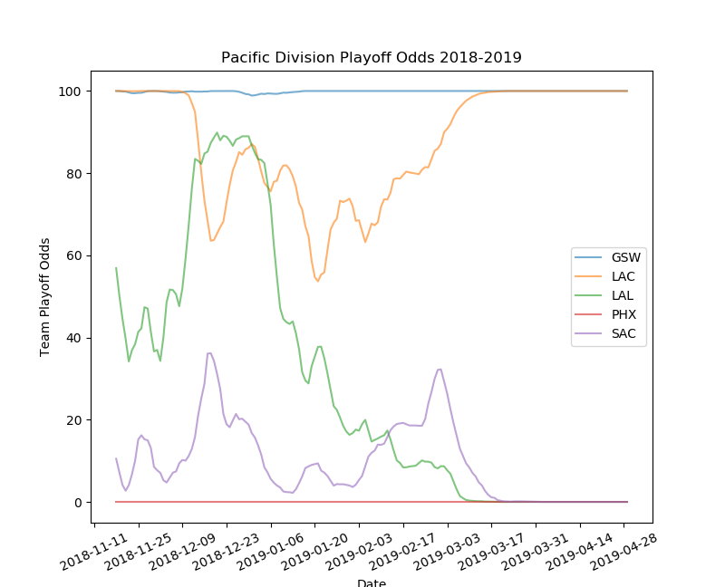

# NBA Playoff Odds

## Summary 
A set of scripts to calculate ratings for teams, based on point differential and strength of schedule, and then use those ratings to determine playoff odds over a given season. 

 
*Sample odds graph*

Main scripts are as follows:

**info_table** - generates a snapshot of a season (pythagorean wins, Strength-of-Schedule adjusted net rating, away record, home record, and overall record)

**plot_season_odds** - creates a graph of playoff odds for teams in one division in one season

**prediction_table** - generates a table of playoff odds

**update_nba_api** - obtains data (for now, just end scores) from the undocumented stats.nba.com api.

## Installation

Use "git clone..." or download a zip.

Monte Carlo simulation extension written in C++ requires g++ compilation using the build script (python/cython_mcss/ext_build.sh) and associated dependencies, see below.

## Requirements

Python requirements:  
the nba_py library (only for update_nba_api) 
peewee 
numpy, scipy, and cython (obtained from the Anaconda scientific distribution) 

C++ requirements for compiling Monte Carlo cython extension:
libarmadillo-dev, libsqlite3-dev

## To Do
Add an example of the output table to README
Improve markdown formatting of README (e.g., link to all mentioned libraries)
Rearrange structure of library (move code one level down into "src"
Write manual test descriptions
Write all scripts in "function" form 
Write automated tests/unit tests