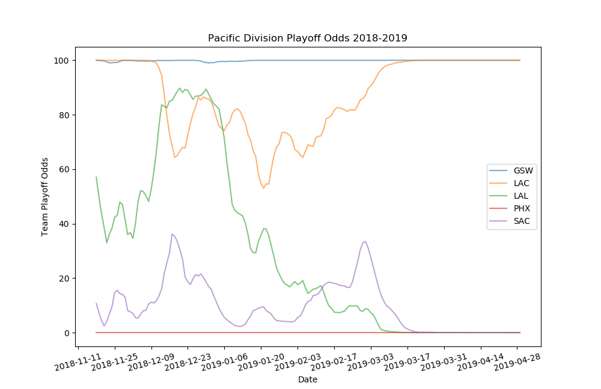

# NBA Playoff Odds

## Summary 
A set of scripts to calculate ratings for teams, based on point differential and strength of schedule, and then use those ratings to determine playoff odds over a given season. 

	
	Playoff odds for the 2019 season as of Jan 01 2019
	============  =============  ===========  ===========
	Conference    Team           Avg. Wins    Playoff %
	============  =============  ===========  ===========
	E             Bucks          63.9         100.0%
	E             Raptors        58.9         100.0%
	E             Pacers         56.4         100.0%
	E             Celtics        54           100.0%
	E             76ers          47.7         100.0%
	E             Hornets        42           98.4%
	E             Heat           39.3         95.6%
	E             Nets           34.5         48.1%
	E             Pistons        34.1         46.7%
	E             Magic          31.1         10.1%
	E             Wizards        27.4         1.1%
	E             Bulls          19.6         0.0%
	E             Hawks          19.4         0.0%
	E             Knicks         18.4         0.0%
	E             Cavaliers      15.9         0.0%
	W             Nuggets        57.3         100.0%
	W             Thunder        54.1         99.7%
	W             Warriors       53.9         99.8%
	W             Jazz           48.4         84.4%
	W             Clippers       47.7         79.5%
	W             Lakers         47.7         83.8%
	W             Rockets        47.3         78.4%
	W             Trail Blazers  46.5         71.1%
	W             Spurs          45.9         61.3%
	W             Kings          41.3         11.6%
	W             Pelicans       41.2         13.4%
	W             Grizzlies      41           11.1%
	W             Mavericks      39           3.7%
	W             Timberwolves   38.1         2.2%
	W             Suns           18           0.0%
	============  =============  ===========  ===========

*Sample odds table*

 

*Sample odds graph*

Main scripts are as follows:

**info_table** - generates a snapshot of a season (pythagorean wins, Strength-of-Schedule adjusted net rating, away record, home record, and overall record)

**plot_season_odds** - creates a graph of playoff odds for teams in one division in one season

**prediction_table** - generates a table of playoff odds

**update_nba_api** - obtains data (for now, just end scores) from the undocumented stats.nba.com api.

## Installation

Use "git clone..." or download a zip.

Monte Carlo simulation extension written in C++ requires g++ compilation using the build script (python/cython_mcss/ext_build.sh) and associated dependencies, see below.

## Requirements

Python requirements:  
the nba_py library (only for update_nba_api)  
peewee  
numpy, scipy, and cython (obtained from the Anaconda scientific distribution)  

C++ requirements for compiling Monte Carlo cython extension:  
libarmadillo-dev   
libsqlite3-dev  

## To Do
Improve markdown formatting of README (e.g., link to all mentioned libraries)  
Rearrange structure of library (move code one level down into "src"  
Write manual test descriptions  
Write all scripts in "function" form   
Write automated tests/unit tests  